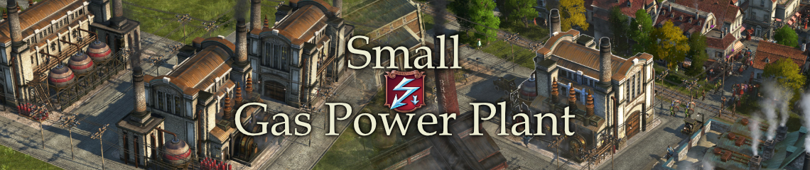

# Jakob's Anno 1800 Mods

## How to use

- Be sure how to use either the [Anno Mod Manager](https://www.nexusmods.com/anno1800/mods/35) or the [Anno Mod Loader](https://github.com/xforce/anno1800-mod-loader) directly.
- Make sure you always have the latest version of the Anno Mod Loader installed. Mods won't show up after game updates otherwise.
- Either download individually from [Nexus Mods](https://www.nexusmods.com/anno1800/users/124999118?tab=user+files)
- Or download collection from [GitHub releases](https://github.com/jakobharder/anno-1800-jakobs-mods/releases)

## Build and Modify Yourself

The mods in this repository are made with the [Modding Tools for Anno](https://marketplace.visualstudio.com/items?itemName=JakobHarder.anno-modding-tools) extension for [VS Code](https://code.visualstudio.com/).

## Mods

[\[Addon\] Nate's Windmill](./nates-windmill/) - The windmill provides electricity within a very small area.

[\[Gameplay\] Small Gas Power Plant](./small-gas-power-plant/) - Half cost, 40% coverage gas-fired power plant.

[\[Misc\] New Town Hall, as Buidings](./new-town-hall-buildings/) - New town hall and city hall tower buildings.

[\[Misc\] New Town Hall, as Variations](./new-town-hall-variations/) - New town hall as shift+v variations.

[\[Addon\] Pescatarians](./pescatarians/) - Alternative population with farmer workforce bonuses.

Needs:

- [\[Shared\] Extra Goods Collection](./extra-goods-collection) - Cheese, Olive Soap, Hemp, Canned Fish, ...
- [\[Misc\] Colored Roofs, Residences](./residence-skin-pack) - GPU memory optimized roof color skins.

[\[Addon\] Upgradable Workers](./upgradable-low-tier) - Modern 2 and 3 floor worker residences.

Needs:

- [\[Shared\] Extra Goods Collection](./extra-goods-collection) - Cheese, Olive Soap, Hemp, Canned Fish, ...