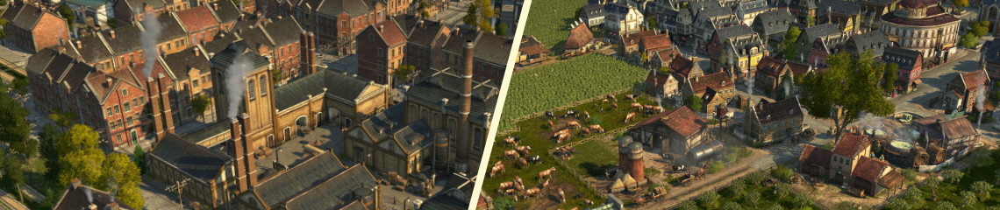
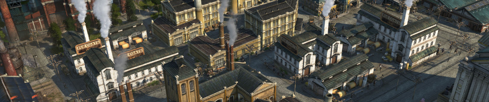
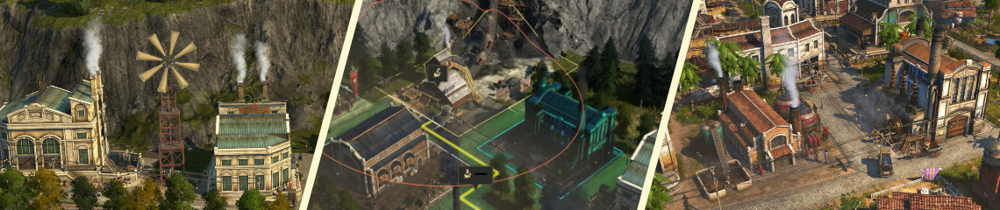
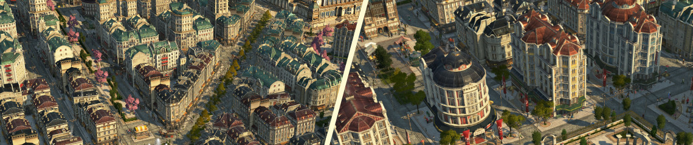

# Jakob's Collection - Anno 1800 Mods

New tiers, products, industries and more than 300 new visual assets (custom models, variations, skins, ...).

## How to use

- Be sure how to use either the [Anno Mod Manager](https://www.nexusmods.com/anno1800/mods/35) or the [Anno Mod Loader](https://github.com/xforce/anno1800-mod-loader) directly.
- Make sure you always have the latest version of the Anno Mod Loader installed. Mods won't show up after game updates otherwise.
- Download from [GitHub releases](https://github.com/jakobharder/anno-1800-jakobs-mods/releases) page.

## Changes

Versions are always kept compatible, except when game updates force me to do differently.

Rebalancing of productions may only happen when the first version number changes, but they are still save to update in existing savegames.

See full [changelog](./CHANGELOG.md).

## Population Tier Mods

- [\[Addon\] Upgradable Workers](./mods/upgradable-low-tier/README.md)
  
  Adds "skyscraper" levels to workers and artisans with more residents and new needs.

- [\[Addon\] Pescatarians](./mods/pescatarians/README.md)

  Adds Old World population with 3 tiers and new needs. They provide additional farmer workforce also in worker and artisan houses.

- [\[Shared\] Extra Goods Collection](./mods/extra-goods-collection/README.md)

  Adds production chains for Upgradable Workers and Pescatarians: milk, cheese, olives, canned Fish, (mass produced) suits, tools, ...

## Public Building Variation Mods

- [\[Misc\] New Town Hall, as Buidings](./mods/new-town-hall-buildings/README.md)
  (separate build icon)

  Adds 3 red brick town halls, the "new town hall" and two smaller town hall skyscrapers.

- [\[Gameplay\] Commercial Street](./mods/shopping-street/README.md)
  (seprate build icon)

  Adds small malls and restaurants fitting nicely into engineer and investor blocks. 

## Industrial Variation Mods

- [\[Misc\] Production Variations](./mods/production-variations/README.md)
  (Shift+V variations)

  Adds variations to vanilla production buildings.

- [\[Gameplay\] Modular Factories](./mods/modular-factories/README.md)
  (separate build icon)

  Adds factory variants of vanilla productions adjusting their visuals when built in blocks.

  Tools factory from `Extra Goods` is already modular.

- [\[Misc\] Docklands Gate](./mods/docklands/README.md)
  (Docklands module)

  Adds a gate that connects modules across streets to keep atractiveness bonus.

  Available in the New World when played with [New World Docklands](https://www.nexusmods.com/anno1800/mods/215).

## Electricity Mods

- [\[Gameplay\] Nate's Windmill](./mods/nates-windmill/README.md)

  Adds a windmill with small range but infinite power.

- [\[Gameplay\] Small Power Plants](./mods/small-gas-power-plant/README.md) 

  Adds coal, oil and gas power plants with reduced cost and coverage.

  Coal power is free when built next to a coal mine.

- [\[Gameplay\] Small Power Plants, Biogas](./mods/biogas-plant/README.md)

  Adds production to process dung from animal farms into gas.

- [\[Gameplay\] Small Power Plants, New World](./mods/small-power-new-world/README.md)

  Enables `Windmill` and `Small Power Plants` mods in the New World.

## Residential Variation Mods

- [\[Misc\] Diagonal Residences](./mods/diagonal-residences/README.md)
  (separate build icon)

  Adds diagonal residences (engineers only currently).

  You might be interested in [jje1000's Diagonal Roads](https://www.nexusmods.com/anno1800/mods/164) as well.

- [\[Gameplay\] Small Hotels](./mods/small-hotels/README.md)
  (separate build icon)

  Adds a small hotel with 4 variations and many skins, as well as skins for the original hotel.

  Available in the New World when played with [New World Tourism](https://github.com/anno-mods/New-World-Tourism).

- [\[Misc\] Colored Roofs](./mods/residence-skin-pack/README.md)
  (paintbrush skins)

  Adds paintbrush skins for Artisans and Engineers (also diagonal).

  Uses less video memory for better performance than the Colour Collection, but is mostly on roof changes.

## Build and Modify Yourself

Download the [mod sources as zip file](https://github.com/jakobharder/anno-1800-jakobs-mods/archive/refs/heads/main.zip).

The mods are made with the [Modding Tools for Anno](https://marketplace.visualstudio.com/items?itemName=JakobHarder.anno-modding-tools) extension for [VS Code](https://code.visualstudio.com/).
Install the plugin, open a mod folder and press `F1` and choose `Build Anno Mod`.

## Translations

I appreciate feedback if you encounter wrong or missing translations.
Easiest way to contact is @jakob in the modding discord (or Annoverse).

Available: English, German, (Russian, Korean, French, Polish, Chinese).

## Special Thanks

- @taubenangriff for sharing some assets
- @taludas for playtest feedback
- redzmey1 for Russian translation
- MSHS for Korean translation
- @Petritant for French translation
- Aveneger432 for Polish translation
- darknesswei for Chinese translation
