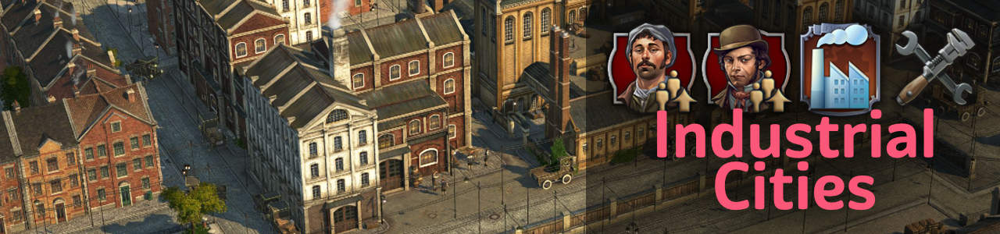
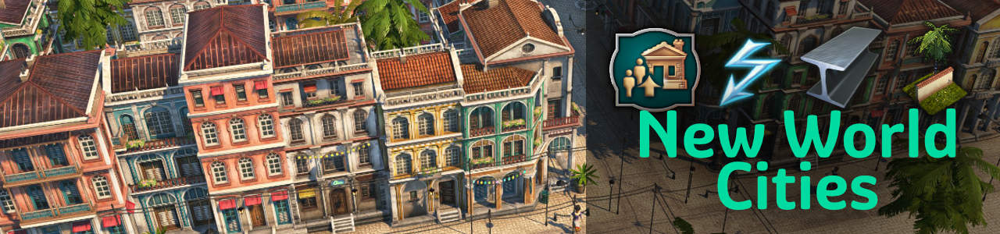
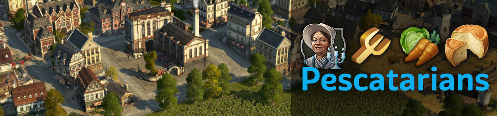
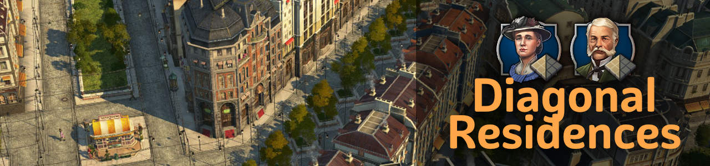
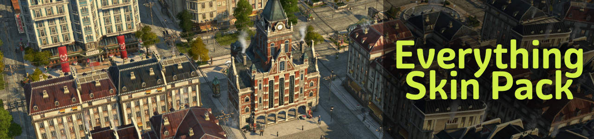
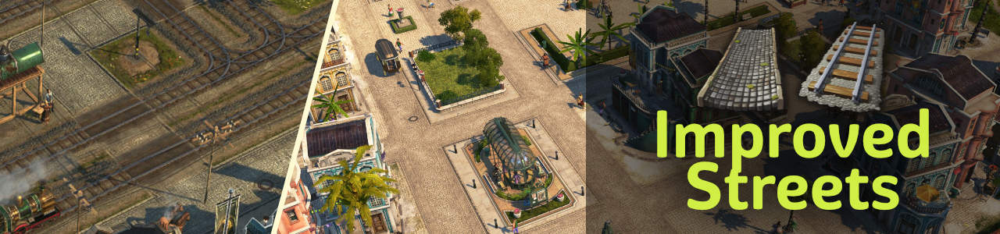
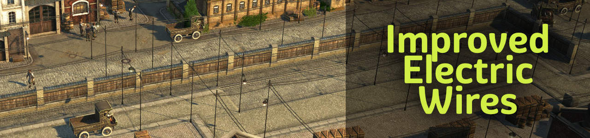
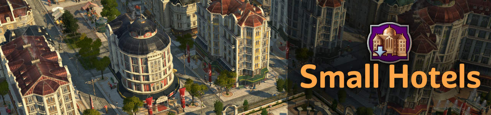

# Jakob's Collection - Anno 1800 Mods

New population tiers, products, industries and tons of new visual assets (custom models, skins, ...).

## Download from [GitHub releases](https://github.com/jakobharder/anno-1800-jakobs-mods/releases)

Either use [iModYourAnno](https://github.com/anno-mods/iModYourAnno/releases) mod manager or know [how to install mods manually](https://github.com/jakobharder/anno1800-mod-loader#mods).

:warning: DO NOT download via the green code button.
That's the source code and it won't run.
Never use that button anywhere if you want to play Anno mods.

## Changes

All mods are compatible previous versions and can be added to existing savegames. Smaller rebalancing may happen and will be listed in the changelogs for you to adjust.

See full [changelog](./doc/CHANGELOG.md).

## `[Addon] Industrial Cities`

Terraced houses with skyscraper-like levels for workers, artisans.
They come with new needs, productions and fitting ornaments.

### Gameplay

- Tiers: 2 worker tiers, 2 artisan tiers

### Buildings

- Terraced worker houses (2 Levels)
- Terraced artisan houses (2 Levels)
- Modular sewing machine factory
- Docklands gate module (street gate)
- Small power plants (coal, oil, gas)
- Fuel pump station (fuel station + oil pump in one building)

### Productions

- Tea import dock, tea factory
- Tools workshop
- Suits factory, hemp farm, linen maker
- Canned fish factory, olive orchard

### Ornaments

- NW stone pavement + ornaments from all categories
- Passenger and cargo platforms, dirt and concrete tiles
- Various cargo train variations

## `[Addon] New World Cities`

Terraced houses for artistas, construction material production and more electricity options for the New World.
They come with new needs, productions and fitting ornaments.

### Gameplay

- Tiers: 2 Artista tiers (terraced, skyscraper)

### Buildings

- Terraced artista houses
- Artista skyscrapers
- Enables `Windmill` and `Industrial Cities` power plants in the New World

### Productions

- NW Steelworks
- NW Concrete Factory
- NW Glassmaker
- NW Window Maker

### Ornaments

- NW stone pavement + ornaments from all categories
- Hacienda walls on grass and dirt

## `[Addon] Pescatarians`

Pescatarians are an alternative OW population.
Ideally for more farmer workforce with artisan-looking towns.

### Gameplay

- Tiers: 2 Pescatarian Tiers all providing 1/3 farmer, 1/3 worker & 1/3 artisan per resident
- Completely different needs

### Buildings

- Pescatarian residence (2 Tiers)
- Community center
- Music school

### Productions

- Vegetable farm, kitchen
- Cheese dairy, milk farm
- Tools workshop
- Suits factory, hemp farm, linen maker
- Canned fish factory, olive orchard
- Olive soap maker, olives

## `[Building] Diagonal Residences`

### Buildings

- Diagonal engineers: including Vibrant Cities and 4 custom skins
- Diagonal investors: including Vibrant Cities and 3 custom skins
- Narrow engineers
- Skins matching jje1000's red tile roof buildings for engineers

### Ornaments

- Diagonal enclosed greenery on plaza and stone pavement
- Skins with diagonal and other corner variations for fences and park paths

You might be interested in [jje1000's Diagonal Roads](https://www.nexusmods.com/anno1800/mods/164) as well.

## `[Skin] Everything Skin Pack`

### Skins

- New town halls:
  adds 3 red brick town halls, the "new town hall" and two smaller town hall skyscrapers.
- Residence Skins:
  adds paintbrush skins for artisans and engineers (also diagonal).
  Uses less video memory for better performance than the Colour Collection, but is mostly on roof changes.

### Shift+V Variants

- Factory variants:
  adds Shift+V variations to vanilla production buildings.

## `[Skin] Improved Streets`

Replaces railroads and NW streets with more fitting textures.

### Textures

- More sandy NW stone street
- Wider railway texture to fit both cities and rural areas

## `[Skin] Improved Electric Wires`

Replaces electric wires and poles with lighter, less distracting models.

## `[Building] Small Hotels`

Adds hotel skins and new smaller hotels.

### Buildings

- Small Hotel OW, 4 variants and many skins
- Small Hotel NW, if played with [New World Tourism](https://github.com/anno-mods/New-World-Tourism)

### Skins

- Hotel OW
- Hotel NW, if played with [New World Tourism](https://github.com/anno-mods/New-World-Tourism)

## `[Building] Nate's Windmill`

  Adds a windmill with small range but infinite power.

## `[Building] Biogas Production`

  Adds production to process dung from animal farms into gas.

## `[Building] Commercial Street`

  Adds small malls and restaurants fitting nicely into engineer and investor blocks.

## `[Gameplay] Alternative Needs`

Adds products from `[Addon] Industrial Cities` and `[Addon] Pescatarians` available as lifestyle needs as alternatives to some basic needs.

## `[Gameplay] New World Tourism, Small Monument Base`

  10x10 instead of 14x14 base for Christo Redentor from [New World Tourism](https://github.com/anno-mods/New-World-Tourism).

## Build and Modify Yourself

Download the [mod sources as zip file](https://github.com/jakobharder/anno-1800-jakobs-mods/archive/refs/heads/main.zip).

The mods are made with the [Modding Tools for Anno](https://marketplace.visualstudio.com/items?itemName=JakobHarder.anno-modding-tools) extension for [VS Code](https://code.visualstudio.com/).
Install the plugin, open a mod folder and press `F1` and choose `Build Anno Mod`.

## Translations

I appreciate feedback if you encounter wrong or missing translations.
Easiest way to contact is @jakob in the modding discord (or Annoverse).

Available: English, German, (Russian, Korean, French, Polish, Spanish, Chinese).

## Special Thanks

- m_belonosov, redzmey1, DrD_AVEL for Russian translations
- MSHS for Korean translations
- Tonton Yip, Petritant for French translations
- HeroOfOlympus, Aveneger432 for Polish translations
- darknesswei for Chinese translation
- mfuegar for Spanish translations
- Taubenangriff for sharing some assets
- Taludas, Ionovia for playtest feedback
- Kurila for improvements on compact UI, shared products and extra goods
