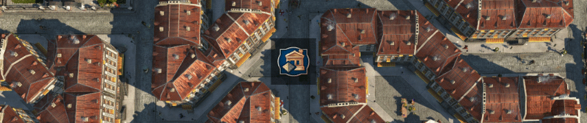

# Jakob's Collection - Anno 1800 Mods

## How to use

- Be sure how to use either the [Anno Mod Manager](https://www.nexusmods.com/anno1800/mods/35) or the [Anno Mod Loader](https://github.com/xforce/anno1800-mod-loader) directly.
- Make sure you always have the latest version of the Anno Mod Loader installed. Mods won't show up after game updates otherwise.
- Download collection from from [Nexus Mods](https://www.nexusmods.com/anno1800/mods/281)
- Or download individual mods from [GitHub releases](https://github.com/jakobharder/anno-1800-jakobs-mods/releases)

## Build and Modify Yourself

The mods in this repository are made with the [Modding Tools for Anno](https://marketplace.visualstudio.com/items?itemName=JakobHarder.anno-modding-tools) extension for [VS Code](https://code.visualstudio.com/).

## Jakob's Collection

[\[Addon\] Upgradable Workers](./upgradable-low-tier/README.md) (increased worker workforce)

- Skyscraper-like upgrades for worker residences.
- Optional: Basic needs to advance to level 2 from "[Shared] Extra Goods Collection" (already part of download) or "Docklands" DLC.
- Optional: "Lands of Lions" DLC or "Docklands" DLC to achieve 40 workers (and max out level 2).

[\[Addon\] Pescatarians](./pescatarians/README.md) (increased farmer workforce)

- Alternative Old World population providing extra farmer workforce.
- Needs "[Shared] Extra Goods Collection" (already part of download) or Docklands DLC to provide needs.
- Needs "Lands of Lions" DLC (or just "Docklands" DLC) to provide some of the Pescatarians Artisans basic needs.
- Optional: residences only change their visuals when played with "[Misc] Colored Roofs, Residences".

[\[Gameplay\] Nate's Windmill](./nates-windmill/README.md)

[\[Gameplay\] Small Power Plants](./small-gas-power-plant/README.md) 

[\[Gameplay\] Small Power Plants, Biogas](./biogas-plant/README.md)

- Wind, coal, oil and gas power plants with reduced cost and coverage.
- Process waste from cattle and pig farms into gas.

[\[Misc\] Diagonal Residences](./diagonal-residences/README.md)

[\[Misc\] Colored Roofs](./residence-skin-pack/README.md) (GPU memory friendly)

- Diagonal residences.
  Engineers only currently.
  You might be interested in [jje1000's Diagonal Roads](https://www.nexusmods.com/anno1800/mods/164) as well.
- Various roof colors as paintbrush skin for Artisans and Engineers.
  Other tiers may follow at some point in time.
- The roofs are colored in real time.
  That leads to better performance due to less used texture memory.

[\[Gameplay\] Small Hotels](./small-hotels/README.md)

[\[Shared\] Extra Goods Collection](./extra-goods-collection/README.md)

- Production chains: milk, cheese, olives, canned Fish, (mass produced) suits, tools, ...
- Cafe recipe: hot chocolate

## Standalone Mods

[\[Misc\] New Town Hall, as Buidings](./new-town-hall-buildings/README.md) - New town hall and city hall tower buildings.

[\[Misc\] New Town Hall, as Variations](./new-town-hall-variations/README.md) - New town hall as shift+v variations.

## Translations

Available: English, German, Russian.
Other translations are mostly there but incomplete.

Contact me if you have new or improved translations.

## Special Thanks

@taubenangriff for sharing some assets, @taludas for playtest feedback and redzmey1 for Russian translation!
