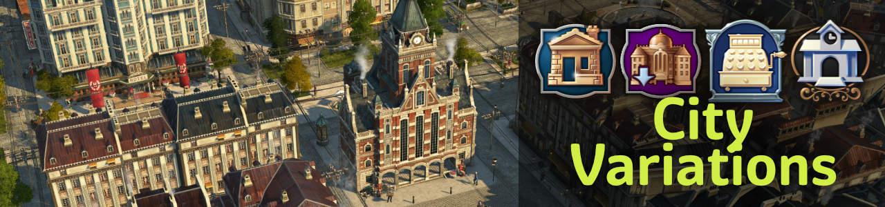

# Jakob's Collection - Anno 1800 Mods

New population tiers, products, industries and tons of new visual assets (custom models, skins, ...).

## How to Get

These are your options:

- Subscribe at [Mod.io](https://mod.io/g/anno-1800/u/jakobscollection)
- Download and install using [iModYourAnno](https://github.com/anno-mods/iModYourAnno/releases) mod manager
- [Install manually](https://github.com/jakobharder/anno1800-mod-loader#mods) with downloads from [Mod.io](https://mod.io/g/anno-1800/u/jakobscollection) or [GitHub releases](https://github.com/jakobharder/anno-1800-jakobs-mods/releases).

## Changes

All mods are compatible previous versions and can be added to existing savegames.
Smaller rebalancing may happen and will be listed in the changelogs for you to adjust.

See full [changelog](./doc/CHANGELOG.md).

## `Jakob's City Variations`

Add more variety to your cities with skins, variations and non-gameplay changing buildings.

### Buildings

- Small Hotel OW, 4 variants and many skins
- Small Hotel NW, if played with [New World Tourism](https://github.com/anno-mods/New-World-Tourism)
- Small Department, Furniture and Drug Store
- Small Store Warehouse (+ skins for all mall types)
- Small Ornamental mall (+ skins for all mall types)
- Small Courtyard Restaurant
- Small Post Office

### Skins

- Town hall:
  adds 3 red brick town halls, the "new town hall" and two smaller town hall skyscrapers.
- Guild house: higher guild house with 2 color skins
- Residences:
  skins for normal and diagonal residences.
  Use less video memory for better performance than the Colour Collection, but is mostly only roof changes.
- Hotel, also in the NW if played with [New World Tourism](https://github.com/anno-mods/New-World-Tourism)
- Factory variants:
  adds Shift+V variations to vanilla production buildings.

### Ornaments

- Diagonal enclosed greenery on plaza and stone pavement
- Skins with diagonal and other corner variations for fences and park paths

## `Jakob's Industrial Cities`

Terraced houses with skyscraper-like levels for workers, artisans.
They come with new needs, productions and fitting ornaments.

### Gameplay

- Extra population tiers: 2 worker tiers, 2 artisan tiers
- Alternative productions available as lifestyle needs to replace basic needs

### Buildings

- Terraced worker houses (2 levels)
- Terraced artisan houses (2 levels)
- Modular sewing machine factory
- Docklands gate module (street gate)
- Small power plants (coal, oil, gas)
- Fuel pump station (fuel station + oil pump in one building)

### Productions

- Tea import dock, tea factory
- Tools workshop
- Suits factory, hemp farm, linen maker
- Fish cannery factory, olive orchard

### Ornaments

- NW stone pavement + ornaments from all categories
- Passenger and cargo platforms, dirt and concrete tiles
- Various cargo train variations

## `Jakob's New World Cities`

Terraced houses, material and need productions and more electricity options for the New World.

### Gameplay

- Extra population tiers: 1 jornalero tier, 1 obrero tier, 2 artista tiers

### Buildings

- Terraced jornalero houses
- Terraced obrero houses
- Terraced artista houses
- Artista skyscrapers
- Enables `Windmill`, `Biogas Production` and `Industrial Cities` power plants in the New World

### Productions

- NW steelworks
- NW concrete factory (+ limestone quarry)
- NW window maker (+ glass maker and sand pit)
- NW bakery (+ mill)
- NW cheese dairy (+ milking palour)
- NW jam kitchen (from citrus, only with NW Tourism)

### Ornaments

- NW stone pavement + ornaments from all categories
- Hacienda walls on grass and dirt
- Diagonal enclosed greenery on plaza and stone pavement
- Skins with diagonal and other corner variations for fences and park paths

## `Pescatarians (Jakob)`

Pescatarians are an alternative OW population.
Ideally for more farmer workforce with artisan-looking towns.

### Gameplay

- Tiers: 2 Pescatarian Tiers all providing 1/3 farmer, 1/3 worker & 1/3 artisan per resident
- Completely different needs

### Buildings

- Pescatarian residence (2 Tiers)
- Community center
- Music school
- Small post office

### Productions

- Vegetable farm, kitchen
- Cheese dairy, milk farm
- Tools workshop
- Suits factory, hemp farm, linen maker
- Fish cannery, olive orchard
- Olive soap maker, olives

## `Diagonal Residences (Jakob)`

### Buildings

- Diagonal and narrow 3x1 engineers + 3 custom roof skins
- Diagonal and narrow 3x1 investors + 4 custom roof skins
- Vibrant Cities skins are supported
- Additionally, skins matching jje1000's red tile roof buildings for engineers

### Ornaments

- Diagonal enclosed greenery on plaza and stone pavement
- Skins with diagonal and other corner variations for fences and park paths

You might be interested in [jje1000's Diagonal Roads](https://www.nexusmods.com/anno1800/mods/164) as well.

## `Improved Streets (Jakob)`

Replaces railroads and NW streets with more fitting textures.

### Textures

- More sandy NW stone street
- Wider railway texture to fit both cities and rural areas

## `Improved Poles (Jakob)`

Replaces electric wires and poles with lighter, less distracting models.

## `Nate's Windmill (Jakob)`

  Adds a windmill with small range but infinite power.

## `Biogas Production (Jakob)`

  Adds production to process dung from animal farms into gas.

## `Compact Menus (Jakob)`

Combine city construction menu icons into categories: tourists, public services, institutions, malls and administration.

## Build and Modify Yourself

Download the [mod sources as zip file](https://github.com/jakobharder/anno-1800-jakobs-mods/archive/refs/heads/main.zip).

The mods are made with the [Modding Tools for Anno](https://marketplace.visualstudio.com/items?itemName=JakobHarder.anno-modding-tools) extension for [VS Code](https://code.visualstudio.com/).
Install the plugin, open a mod folder and press `F1` and choose `Build Anno Mod`.

## Translations

I appreciate feedback if you encounter wrong or missing translations.
Easiest way to contact is @jakob in the modding discord (or Annoverse).

Always complete: English, German
Partial (sometimes complete): Russian, Korean, French, Polish, Spanish, Chinese.

## Credits

- Taubenangriff, Lordys, Drakkam for sharing some graphic assets
- Taludas, Ionovia for playtest feedback
- Kurila for improvements on compact UI, shared products and extra goods
- m_belonosov, redzmey1, DrD_AVEL for Russian translations
- MSHS for Korean translations
- Tonton Yip, Petritant, Water for French translations
- HeroOfOlympus, Aveneger432 for Polish translations
- darknesswei for Chinese translation
- mfuegar for Spanish translations
