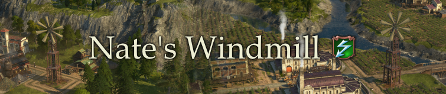

# Nate's Windmill

The windmill is a service building providing electricity to industry and residents.
It's intended as an alternative to Nate's electricity items for guild houses - a little cheaper, but not as powerful to keep it balanced.

## How it works

Electricity is provided the same way power plants work via roads.

The building has a small guild house radius, meaning you cannot build another guild house or windmill overlapping with its area.

The reduced ranges and exclusive radius are there to ensure the windmill is not just cheaper and more powerful than other power plants or the original item + guild house combination.

Industry influence buff apply.
Palace buffs and obviously guild house buffs don't.

### Construction Menu

- Engineers Menu: after oil power plant
- City Menu: after oil power plant

### Stats

- Cost: 90000 credits, 40 steel beams, 10 sail cloths and 5 steam machines
- Maintenance: 400 credits, 50 engineers
- Unlock: 500 engineers
- Guild house radius: 5
- Electricity range: 6

### Required DLCs & Compatibility

- Installed and activated Sunken Treasures (uses model + texture assets)
- Works with existing save games
- GUID range 1500010001 - 1500010006
- I don't expect any issues as there are only additions
