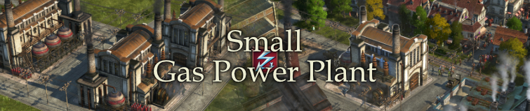

# Small Gas Power Plant

The small gas power plant consumes less gas for reduced range.

## How it works

The building behaves exactly the same as the normal gas-fired power plant.

Cost and maintenance are reduced to half.
Range is reduced to half - meaning coverage is even less than half.
That makes the small version less cost effective, except when combined with buffs or in restricted build situations.

Influence, palace and guild house buffs apply.

### Construction Menu

- Investors Menu: in gas power plant tree
- City Menu: in gas power plant tree

### Stats

- Cost: 40000 credits, 20 timber, 30 bricks, 30 steel beams, 10 windows and 20 concrete
- Maintenance: 600 credits, 125 engineers
- Unlock: same as gas power plant (1 investor)
- Electricity range: 21

### Required DLCs & Compatibility

- Installed and activated The Passage DLC (gas production)
- Works with existing save games
- GUID range: 1500010020
- I don't expect any issues as there are only additions

### Translations

Available: English, French, German, Italian, Polish, Russian, Spanish, Japanese, Korean, Simplified Chinese, Traditional Chinese
Missing: none
