# Progression

## Old World Needs

### Pescatarians I

Need | Consumption | Residents | Coins | Required | Unlock
--- | --- | --- | --- | --- | ---
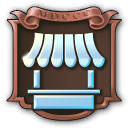 Market | | 4 
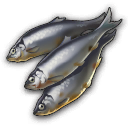 Fish | 0.0006 | 6  | 3 
 Vegetables | 0.0006 | 2  | 3  | 200
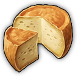 Cheese | 0.00044 | 5  | 7  | 200/400
 Library | | 4  | | 300/600 | 500 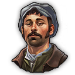
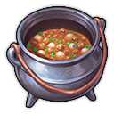 Seafood Stew | 0.0001 | 5  | 7  | 400/750 | 1 
| | | 24 
 | **Luxury** | | | |
 Community | | 5 
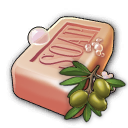 Soap | 0.0003 | 5  | 7  | 300/1000
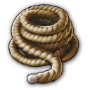 Ropes | 0.0003 | 5  | ?  | 500/1000
 | **Alternative** | | | |
 ~~Vegetables~~ | 0.0006 |  | | 150 |
|| **Lifestyle** | | | |
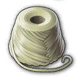 Wool | 0.0001 | 4 
Clay | 0.0005 | 3 
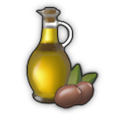 Olive Oil | 0.0004 | 2 

### Pescatarians II

Need | Consumption | Residents | Coins | Required | Unlock
--- | --- | --- | --- | --- | ---
 Market | | 4  
 Cheese | 0.00044 | 5  | 11  | 300
 Seafood Stew | 0.0001 | 5  | 7  | 750
 Library | | 4   | | 200
 Music School | | 6  | | 500
 Suits | 0.0008 | 6  | 16  | 700
 Sardines | 0.0004 | 6  | 16  | 1000
| | | 36 
 | **Luxury** | | | |
 Church | | 5 
 Soap | 0.0003 | 5  | 13 
Theater | | 5  | 5  | 2000
University | | 1  | 7  | 4000
Sewing Machines | 0.0003 | 1  | 18 

### Terraced Workers

Need | Consumption | Residents | Coins | Required | Unlock
--- | --- | --- | --- | --- | ---
 Tea | 0.00026 | 4 | | 800
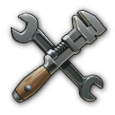 Tools | 0.0004166 | 4 | | 1000
 Electricity | | 2 | | 1200 |
 | **Luxury** | | | |
 Library | | 2  | 20
 | **Level II** | | | |
Suits | 0.0004166 | 5 | | 1500
Sardines | 0.0004166 | 5 | | 1500

### Terraced Artisans

Need | Consumption | Residents | Coins | Required | Unlock
--- | --- | --- | --- | --- | ---
 Tea | 0.00052 | 7 | | 800
Gramophones | 0.000027775 | 7 | | 800 | 3000 investors
 Electricity | | 6 | | 1000 |
 | **Luxury** | | | |
 Music School | | 2  | 20
 Library | | 2  | 20
 | **Level II** | | | |
Bombins | 0.00005555 | 6 | | 1500
Typewriters | 0.000027775 | 7 | | 1500
Violins | 0.000027775 | 7 | | 2000

## New World Needs

### Jornaleros

Need | Consumption | Residents | Coins
--- | --- | --- | ---
Tortillas | 0.000238095 | 5 | 5
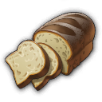 Bread | 0.000238095 | 5 | 5
 Cheese | 0.000238095 | 5 | 5

### Obreros

Need | Consumption | Residents | Coins
--- | --- | --- | ---
(Tortillas) | 0.00047619 | 4 | 2
 Bread | 0.00047619 | 5 | 5
 Cheese | 0.00047619 | 5 | 5
 Electricity | - | 5 | 2

### Artistas

Need | Consumption | Residents | Coins | Required | Unlock
--- | --- | --- | --- | --- | ---
(Tortillas) | 0.00047619 | 5 | (10) 15
(Scooter) | 0.00002898 | 5 | (45) 67 | 6000/8000
| | **Terraced Artista** |
 Bread | 0.00047619 | 5 | 45
 Electricity | - | (20) | (45)
 Gramophones | 0.00011905  | 5  | 48  | 3200/6000
| | **Artista Skyscraper** |
 Sardines | 0.00011905 | 10  | 60  | 6000/8000
Violins | 0.000053 | 10 | 75

### Patronos

Need | Consumption | Residents | Coins | Required | Unlock
--- | --- | --- | --- | --- | ---
 Electricity | - | ? | ?
 Gramophones | 0.00011905  | ?  | ?  | ?
 Sardines | 0.00011905 | ?  | ?  | ?