# Progression

Condition | Milestone | Note
--- | --- | ---
400  | Pescatarians
250  | Factory Complex | TBD is 250 Artisans
800  | Terraced Houses
1  | Electricity
| | Concrete Factory
500  | Steam Machines
| | Terraced Houses II
5000 Investors | Elevators

## Old World Unlocks

Unlock | Content | Unhide
--- | --- | ---
150 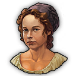 | *Worker unlock*
|| **`Pescatarians`**
1  | 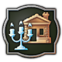 Pescatarians - Level 1 | 150 
| |  Community
| |  Vegetables
| | 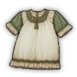 Clothes (from  Flax)
| |  Cheese (from  Milk) | 1 
| | 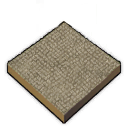 Stone Pavement
500  |  Library | 300 
| |  Soap (from 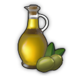 Olive Oil, 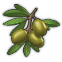 Olives)
| |  Ropes (from  Hemp)
| |  Seafood Stew (from  Calamari +  Vegetables + 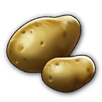 Potatoes)
750  | *Artisan unlock* | 500 
| |  Docklands Gate | 1 
| | **`Factory Complex`**
500  |  Industrial Butcher | 250 
| | 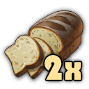 Industrial Bakery + 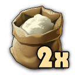 Industrial Flour Mill
| | 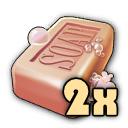 Industrial Soap Factory + 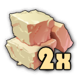 Industrial Rendering
| |  Industrial Brewery + 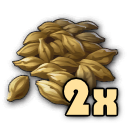 Industrial Malthouse
| | **`Terraced Houses`**
900  |  Pescatarians - Level 2
| |  Terraced Workers - Level 1 | 750 
| |  Terraced Artisans - Level 1 | 750 
| |  Music School
| |  Suits (from  + )
| |  Sardines (from  +  + 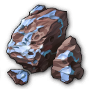) |
| |  Tools (from 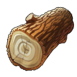 + 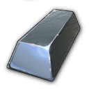) |
| |  Tea (from 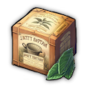 + 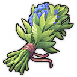)
1500  | *University (for Pesca II)* | 900 
| | *Engineer unlock*
1  | *Vanilla electricity & oil power plants* | none
| | `Terraced Houses II`
500  |  Terraced Workers - Level 2 | 1 
| |  Terraced Artisans - Level 2
| |  Small Coal +  Small Oil Power Plant
| |  Railway platforms
| | `Nate's Windmill`
1 Investor | Biogas Production | 1 

## New World Unlocks

Condition | Content | Unhide
--- | --- | ---
750 Obreros | **New World Cities I** | 500 Obreros
| | `New World Cities` ornaments
| | `New World Cities` terraced jornaleros |
| | `New World Cities` terraced obreros |
| | `New World Cities` maize bread chain |
| | (NW Tourism only) `New World Cities` citrus jam chain |
1000 Obreros | *Artista unlock*
1500 Obreros 300 Artistas | **New World Cities II** | 750 Obreros
| | `New World Cities` construction materials |
| | `Biogas Production` |
| | `Nate's Windmill` |
300 Artistas | **New World Cities III** | 1 Artista
| | `New World Cities` terraced artista houses |
4000 Tourists | `New World Tourism` | 1500 Obreros
