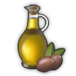

# Progression

Condition | Milestone | Note
--- | --- | ---
400  | Pescatarians
250  | Factory Complex | TBD is 250 Artisans
800  | Terraced Houses
1  | Electricity
| | Concrete Factory
500  | Steam Machines
| | Terraced Houses II
5000 Investors | Elevators

## Old World Unlocks

Condition | Content | Unhide
--- | --- | ---
1  | `Industrial Cities` stone pavement
150  | *Bakery unlock*
400  | **`Pescatarians`**  | 1 
| |  Vegetables | 150 
| |  Clothes (from  Flax) | 150 
| |  Community
| |  Library
| |  Cheese (from  Milk) | 150 
| |  Soap (from  Olive Oil,  Olives) | 300 
750  | *Artisan unlock* | 500 
250  | *Variaty theater (for Pesca II)*
|| **`Industrial Cities` - Factory Complex**
| | `Industrial Cities` docklands gate | 1 
| | `Industrial Cities` modular sewing machine factory (same as vanilla)
| | `Industrial Cities` soap factory, rendering works
| | `Industrial Cities` bakery, flour mill
| | `Industrial Cities` butcher
| | TBD `Industrial Cities` worker cloths
| | `Industrial Cities` tools factory (need for Pesca I??) | none
800  | **Industrial Cities III - Terraced Houses**
| | `Industrial Cities` suits factory | none
| | `Industrial Cities` terraced workers level 1 | 750 
| | `Industrial Cities` terraced artisans level 1 | 1 Artisan
| | `Industrial Cities` tea docks TBD (is 400 engineers) | none
| | `Industrial Cities` Fish cannery |
| | `Industrial Cities` products: tools, suits, sardines | none
1500  | *University (for Pesca II)* | 900 
| | *Engineer unlock*
1  | *Vanilla electricity & oil power plants* | none
500  | **Industrial Cities IV - Terraced Houses II** | 1 
| | `Industrial Cities` small coal and oil power plants
| | `Industrial Cities` railway platforms
| | `Shared` diagonal ornaments TBD (is immediately now)
| | `Industrial Cities` terraced workers level 2
| | `Industrial Cities` terraced artisans level 2
| | `Nate's Windmill`
1 Investor | Biogas Production | 1 

## New World Unlocks

Condition | Content | Unhide
--- | --- | ---
750 Obreros | **New World Cities I** | 500 Obreros
| | `New World Cities` ornaments
| | `New World Cities` terraced jornaleros |
| | `New World Cities` terraced obreros |
| | `New World Cities` maize bread chain |
| | (NW Tourism only) `New World Cities` citrus jam chain |
1000 Obreros | *Artista unlock*
1500 Obreros 300 Artistas | **New World Cities II** | 750 Obreros
| | `New World Cities` construction materials |
| | `Biogas Production` |
| | `Nate's Windmill` |
300 Artistas | **New World Cities III** | 1 Artista
| | `New World Cities` terraced artista houses |
4000 Tourists | `New World Tourism` | 1500 Obreros
