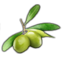
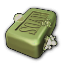
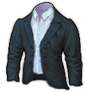

# Extra Goods Collection

## Notes for Players

You only need this mod if another mod told you so.

The goods in this mod are not unlocked by default.
They are only usable through other mods.

You might want to look at [Pescatarians (Alternative Population)](https://github.com/jakobharder/anno-1800-jakobs-mods) or [Upgradable Workers](https://github.com/jakobharder/anno-1800-jakobs-mods).

## Notes for Modders

Feel free to depend on this mod for your own creations.
Do not copy contents of the mod into yours, but point to download links on *GitHub* or *Nexus Mods*.
Otherwise people will end up with version conflicts.

All goods unlock with 1500 Artisans. If you require something earlier, you may trigger additional unlocks using the AssetPool GUIDs.

Linen, Suits and Canned Fish depend on Land of Lions.
Make sure to remind the players if you use those goods.

*Note: You can use Hemp good, Hemp production and Canned Fish good.*
*But there won't be any build menu or production building for Canned Fish without Land of Lions.*

The rest has no DLC dependencies.

## Changes

## 1.5

- Fixed warehouse/docklands issues
- Increased trade price of cheese (45 -> 80)
- Decreased hemp farm modules (168 -> 128)
  Increased running costs instead (20 -> 50 coins, 20 -> 30 farmers)

### 1.2

- Accessories, Olive Soap and Bottled Beer now unlocks with 1st built Pescatarian Community Center
- Canned Fish and Suits moved to workers construction menu

### 1.1

- New dairy model
- Hot chocolate bar recipe

## Goods

Use AssetPool GUIDs to unlock the products with their production chains.

| Icon | Name | Region | GUID | Unlock | AssetPool | Comment
| --- | --- | --- | --- | --- | --- | ---
|  | Wooden Accessories | Old World |1500010150 | - | 1500010162
|  | Milk | Old World | 1440005 | - | 1500010167 | New Horizon GUID
|  | Cheese | Old World | 1500010102 | - | 1500010167
|  | Olives | Old World | 1500010105 | - | 1500010166
|  | Olive Soap | Old World | 1500010106 | - | 1500010166
|  | Tools | Old World | 1500010153 | - | 1500010163
|  | Canned Fish | Old World | 1500010120 | - | 1500010164
|  | Hemp | Old World | 1440224 | - | 1500010165 | New Horizon GUID
|  | Linen | Old World | vanilla | - | 1500010165
|  | Suits | Old World | 1500010127 | - | 1500010165
|  | Bottled Beer | Old World | 1500010156 | - | 1500010168

New Horizon GUIDs are shared with permission.

## Translations

Available: English, German, Russian

Thanks to redzmey1@nexus for Russian translation!

I appreciate any translation feedback! https://discord.com/invite/KtfWbev
