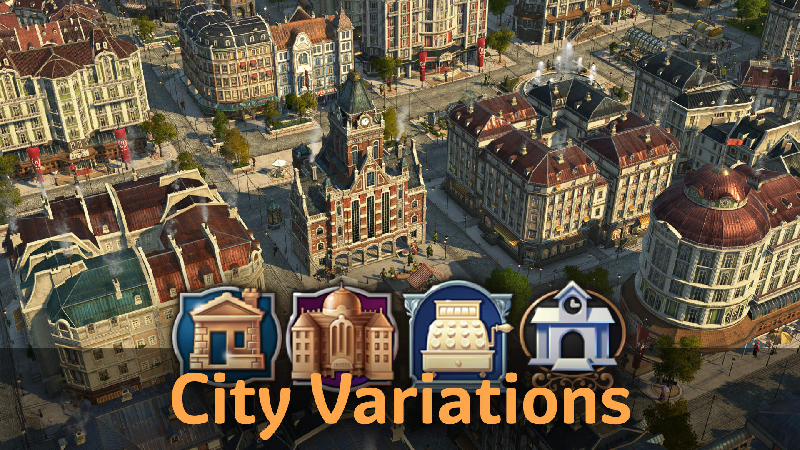

Add more variety to your cities with skins, variations and non-gameplay changing buildings.

Skins and variations do not affect gameplay in any way.

Buildings have a different tile size. Their effects are adjusted accordingly but have otherwise same gameplay functionality.

## Buildings

### Small Hotels (optional)

A small hotel with reduced population including 4 variations and many paintbrush skins.

Only with DLC `Tourist Season`.
Can be disabled with iMYA tweaks.

#### New World Tourism

The small hotels and normal hotel skins can be used in the New World if you use the [New World Tourism](https://github.com/anno-mods/New-World-Tourism) mod.

### Commercial Street (optional)

The buildings function and unlock the same as their normal counterparts, but with decreased range. The buildings do not count as quest objectives.

- Department, Furniture and Drug Store
- Store Warehouse (+ skins for all mall types)
- Ornamental mall (+ skins for all mall types)
- Courtyard Restaurant

Only with DLC `The High Life` and DLC `Tourist Season`.
Can be disabled with iMYA tweaks.

### Small Post Office

Functional post office fitting into smaller OW towns.

Only with DLC `Empire of the Skies`.

## Skins and Shift+V Variations

Note: `Shift+V` is blocked on already built buildings.
You can either change the variation before you build it or pick it up again and change then.

### Town Hall and Guild House Skins

Paintbrush skins for town halls and guild houses.

- New Town Hall with 5 roof color skins
- Red Town Hall with 3 model skins (DLC `Land of Lions` only)
- 2 City Hall Towers skins (DLC `The High Life` only)
- City Guildhouse with 2 skins

### Residence Skins

Paintbrush skins for NW and OW residences and hotels.

The roofs are colored in realtime for reduced memory usage and better performance.

- Obreros, white walls
- Workers, yellow bricks
- Artisans, various wall and roof skins
- Engineers, various roof skins
- Investors, various roof skins
- Hotels, various wall and roof skins

### Ornaments

- Diagonal enclosed greenery on plaza and stone pavement
- Skins with diagonal and other corner variations for fences and park paths

## Changes

- 1.1: Brick Post Office skin

## Credits

Thanks to MSHS, Aveneger432, darknesswei, Tonton Yip, mfuegar, DrD_AVEL, modpark817, DATM for translations!

