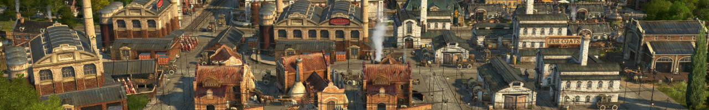

Terraced houses, industrialized productions and .

Give your cities a 19th/20th century industrialization vibe and increase population and production densitity.

## Content

### 1 - Pescatarians

*Unlocks at 400 workers - or creative mode*

Pescatarians are upgrades to **farmer residences** with mixed workforce of 50% farmer, 25% worker and 25% artisan.
They allow for more dense farming towns.

**Residences** to house the Pescatarians.

- Pescatarian **Level 1**
  - with cheese and library as basic needs.
  - Upgrades to terraced artisans
- Pescatarian **Level 2**
  - with sardines and suits as basic needs.
  - Upgrades to engineers

**Public services**

- **Community Center**
  - Functions as both marketplace and church replacement for Pescatarians.
- **Library**
  - Basic need for Pescatarians
  - Luxury need for 
- **Small Post Office**

**Needs productions** for additional residents.

- **Cheese**
  - Dairy Farm
  - Cheese Dairy
- **Soap** from Olives
  - Olive Grove
  - Olive Oil Press
  - Olive Soap Factory
- **Sardines**
  - Fish cannery consuming olives, fish and iron ore
  - Olive orchard
- **Suits**
  - Suits factory consuming linen and wool
  - Linen cloth maker consuming hemp
  - Hemp farm

### 2 - Industrial Factory Complex

*Unlocks at 250 artisans - or creative mode*

**Productions** visually merge together into big complexes.
Doubled factories have 200% production, 180% workforce and 300% maintenance cost.

- **Working Cloth**
  - Knitter (doubled, worker workforce)
- **Bread**
  - Flour mill (doubled)
  - Bakery (doubled)
- **Sausages**
  - Butcher (doubled)
- **Soap**
  - Rendering works (doubled)
  - Soap factory (doubled)
- **Beer**
  - Brewery (doubled)
- **Sewing machines**
  - Sewing machine factory (normal)
- **Tools**
  - Tools factory consuming iron and wood

Other buildings:

- **Docklands Gate**: to connect modules across streets to keep atractiveness bonus (only with DLC `Docklands`)

*Note: the module menu has no scroll option. It may not show some modules if you already have too many module mods.*

### 3 - Terraced Houses

*Unlocks at 800 artisans - or creative mode*. Only with DLC `The High Life`.

**Residences** with increased population capacity.
They merge into blocks like engineers and investors.

- Terraced **worker** houses
  - Level 1: +10 residents with tea, tools and electricity as basic needs.
- Terraced **artisan** houses
  - Level 1: +20 residents with tea, bombins and electricity as basic needs.needs.

*Use short-cut "I" to get into skyscraper upgrade mode before unlocking engineer/investor skyscrapers.*

**Needs productions** for additional residents. All products can also be imported through docklands.

- **Sardines**
  - Fish cannery consuming olives, fish and iron ore
  - Olive orchard
- **Suits**
  - Suits factory consuming linen and wool
  - Linen cloth maker consuming hemp
  - Hemp farm
- **Tea**
  - Tea factory consuimg imported tea
  - Tea importer

**Cosmetics** for terraced houses.

- Stone pavement ornaments as Shift+V variations for various existing ornaments including `City Decoration` and `City Lights Pack`
- Stone pavement with street function

### 4 - Terraced Houses II

*Unlocks at 800 engineers - or creative mode*. Only with DLC `The High Life`.

**Residences** with increased population capacity.
They merge into blocks like engineers and investors.

- Terraced **worker** houses
  - Level 2: +10 additional residents with suits and sardines as basic needs.
- Terraced **artisan** houses
  - Level 2: +20 residents with gramophones, typewriters and violines as basic needs.

Smaller **power plants** and additional energy options.

- Coal power plant with bonus when built next too coal mines
- Small oil power plant
- Small gas power plant
- Fuel station with integrated oil pump

**Cosmetics** for railways.

- Dynamic railway freight and passenger platforms ornaments (only with cDLC `Industrial Zone`)
- Randomized freight train skins

### Additional Cosmetics

*Unlocks immediately*

**Cosmetic** shift+V variations for production buildings.

- Fur Dealer: 3 new variations
- Bakery: 2 new variations (+ skin for stone pavement)
- Cannery: 2 new variations

## Notes and Known Issues

- (workers only) The game always prefers one direction when building a single row of houses. You have to rotate such a building everytime you place or upgrade it or its neighbors.
- The arrows for skyscraper upgrade don't show sometimes. The buildings will upgrade if you click anyway.

## Changes

### 3.2

- 3.2.2: Moved Tea to Artisan construction menu
- 3.2.2: Improved Chinese translation (thanks to hanthe2nd)
- 3.2.2: Improved Spanish translation (thanks to mfuegar)
- 3.2.2: Improved Russian translation (thanks to DrD_AVEL)
- 3.2.1: Fixed docklands depot tool tip
- 3.2.1: Fixed NW docklands gate quay color
- Add cross-progression between terraced and vanilla residences
- Unlock floor upgrade button in construction menu (only with DLC `The High Life`)
- Updated Korean translations (thanks to modpark817)
- Fixed fuel pump station showing no warehouse connection warning in the New World

### 3.1

- Added industrial soap factory and rendering works
- Swaped terraced artisan gramophone and bombin needs
- Rebalanced unlocks (see readme)
- Renamed canned fish to sardines
- Fixed power plants being attacked

### 3.0

- 3.0.5: Fixed various missing and broken text issues
- 3.0.3: Fixed missing ground texture of the oil power plant
- 3.0.3: Coal power plant doesn't drop buff icon anymore
- 3.0.2: Russian translation
- 3.0.1: Fixed blurry icons
- Immediately unlock in creative mode
- Merged `Upgradable Workers`, `Modular Factories`, `Dockland Gates` and `Railway Stations` into one mod
- Added passengers to T crossing platforms
- Added green roof skin for Artisan Terraced Houses
- Increased income from tea
- Fixed unlocks when High Life DLC is not owned

## Credits

Thanks to m_belonosov, redzmey1, MSHS, Petritant, Aveneger432, darknesswei, Tonton Yip, mfuegar, DrD_AVEL, modpark817 for the translations!
