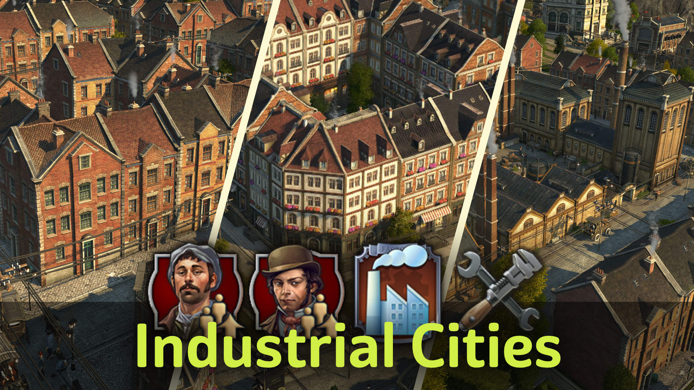
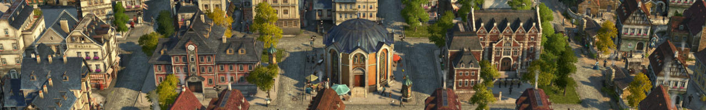
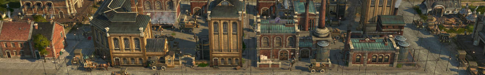
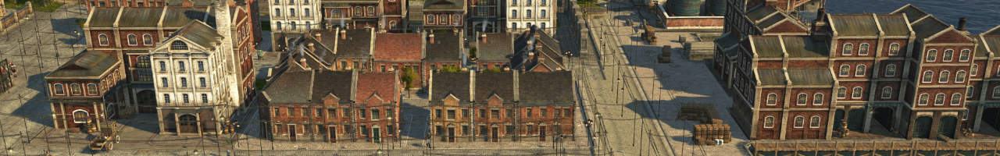
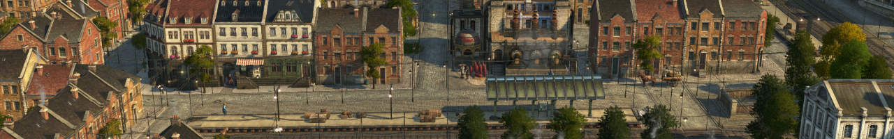

Give your cities a 19th/20th century industrialization vibe and increase population and production densitity.

All features are additional and balanced in difficulty - like DLCs.
No gameplay changes are done to the game.

## DLC Requirements

You can play without any DLC, but the experience with upgrading residences is vastly better with the `High Life` DLC due to having a bulk floor upgrade button.

## Content

1. Pescatarians - aka upgradable farmers
2. Industrial Complex - aka modular factories
3. Terraced Houses - aka upgradable workers and artisans

### 1 - Pescatarians

*Unlocks begin at 1 worker - or creative mode*

Pescatarians are upgrades to **farmer residences** with mixed workforce of 50% farmer, 25% worker and 25% artisan.
They allow for more dense farming towns.

**Residences** to house the Pescatarians.

- Pescatarian **Level 1**
  - with cheese and library as basic needs.
  - Upgrades to terraced artisans
- Pescatarian **Level 2** *(unlocks later)*
  - with sardines and suits as basic needs.
  - Upgrades to engineers

**Public services**

- **Community Center**
  - Functions as both marketplace and church replacement for Pescatarians.
- **Library**
  - Basic need for Pescatarians
  - Luxury need for Terraced Houses
- **Small Post Office**

**Needs productions** for additional residents.

- **Cheese**
  - Dairy Farm
  - Cheese Dairy
- **Soap** from Olives
  - Olive Grove
  - Olive Oil Press
  - Olive Soap Factory
- **Sardines**
  - Fish cannery consuming olives, fish and iron ore
  - Olive orchard
- **Suits**
  - Suits factory consuming linen and wool
  - Linen cloth maker consuming hemp
  - Hemp farm

### 2 - Industrial Factory Complex

*Unlocks at 500 artisans - or creative mode*

**Productions** visually merge together into big complexes.
Doubled factories have 200% production, 180% workforce and 250% maintenance cost.

- **Sausages**
  - Butcher (doubled)
- **Bread**
  - Flour mill (doubled)
  - Bakery (doubled)
- **Soap**
  - Rendering works (doubled)
  - Soap factory (doubled)
- **Beer**
  - Malthouse (doubled)
  - Brewery (doubled)
- **Sewing machines**
  - Sewing machine factory (normal)
- **Tools**
  - Tools factory consuming iron and wood

Other buildings:

- **Docklands Gate**: to connect modules across streets to keep atractiveness bonus (only with DLC `Docklands`)

*Note: the module menu has no scroll option. It may not show some modules if you already have too many module mods.*

### 3 - Terraced Houses

*Unlocks at 900 artisans - or creative mode*. Only with DLC `The High Life`.

**Residences** with increased population capacity.
They merge into blocks like engineers and investors.

- Terraced **worker** houses
  - Level 1: +10 residents with tea, tools and electricity as basic needs.
- Terraced **artisan** houses
  - Level 1: +20 residents with tea, bombins and electricity as basic needs.needs.

*Use short-cut "I" to get into skyscraper upgrade mode before unlocking engineer/investor skyscrapers.*

**Needs productions** for additional residents. All products can also be imported through docklands.

- **Sardines**
  - Fish cannery consuming olives, fish and iron ore
  - Olive orchard
- **Suits**
  - Suits factory consuming linen and wool
  - Linen cloth maker consuming hemp
  - Hemp farm
- **Tea**
  - Tea factory consuimg imported tea
  - Tea importer

**Cosmetics** for terraced houses.

- Stone pavement ornaments as Shift+V variations for various existing ornaments including `City Decoration` and `City Lights Pack`
- Stone pavement with street function

### 4 - Terraced Houses II

*Unlocks at 500 engineers - or creative mode*. Only with DLC `The High Life`.

**Residences** with increased population capacity.
They merge into blocks like engineers and investors.

- Terraced **worker** houses
  - Level 2: +10 additional residents with suits and sardines as basic needs.
- Terraced **artisan** houses
  - Level 2: +20 residents with gramophones, typewriters and violines as basic needs.

Smaller **power plants** and additional energy options.

- Coal power plant with bonus when built next too coal mines
- Small oil power plant
- Small gas power plant
- Fuel station with integrated oil pump

**Cosmetics** for railways.

- Dynamic railway freight and passenger platforms ornaments (only with cDLC `Industrial Zone`)
- Randomized freight train skins

## Notes and Known Issues

- (workers only) The game always prefers one direction when building a single row of houses. You have to rotate such a building everytime you place or upgrade it or its neighbors.
- The arrows for skyscraper upgrade don't show sometimes. The buildings will upgrade if you click anyway.

## Changes

### 4.4

#### General

- 4.4.3: Fixed Docklands Gate blocker
- 4.4.3: Fixed small gas power plant production cycle
- 4.4.3: Fixed milk cattle farm workforce
- Rebalanced Expedition values to better fit vanilla difficulty

#### UI

- 4.4.3: Fixed InfoTip compatibility issue with Kurila's mods
- 4.4.2: Fixed Investors tab merging when "More Construction Menu Tabs" is active
- 4.4.1: Fixed NW Services Tab
- Fixed Tea issues with Noblesse Obligue
- Split consumables construction menu into food provisions and other supplies. Please report if you have issues.
- Merge Engineers and Investors when 3 mod tabs are active
- Remove duplicate entries in merged tabs if they were in both tiers
- Added food and drink venues group to tourists and services construction menu tabs
- Improved Compact Menu grouping with Military Attention
- Improved industrial complex construction InfoTips
- Fixed Pescatarian skin icon

### 4.3

- 4.3.1: Fixed stage banners
- 4.3.1: Fixed vegetable fertility
- 4.3.1: Merge some construction menu tabs when there's not enough space
- Removed field vegetable fertility. They are hardy and grow everywhere.
  That also reduces problems with Noblesse Oblige which merges red pepper and field vegetables.
- Adjusted Pescatarian income to match farmers after upgrading
- Improved icons and factory models for Tea, Imported Tea, Olive Oil
- Fixed some out of order unlocks
- Added "Basic Food" menu group for fish and vegetables
- Removed "Alternatives" menu

### 4.2

- 4.2.2: Fixed compatibility issue with influence for residence mods
- 4.2.2: Fixed various minor issues
- 4.2.1: Fixed Dockland export prices for Olives and Olive Oil
- 4.2.1: Fixed minor unlock/unhide timings
- Renamed Vegetables into Field Vegetables to differentiate better from Red Peppers
- Added support for Khobs' land oil depot
- Added Olive Grove to all crop farms pool
- Removed 100 cost when upgrading from farmer to Pescatarian I
- Fixed Dockland sell prices for Ropes and Olive Oil
- Fixed Pescatarian menu unlocking to early because of the Potato farm
- Fixed Distillery and Malthouse missing in boost menu
- Alternative Needs are now listed last in Lifestyle Needs.
  Recommend to use the Marketplace to activate in InfoTips.

## Credits

Thanks to m_belonosov, redzmey1, MSHS, Petritant, Aveneger432, darknesswei, Tonton Yip, mfuegar, DrD_AVEL, modpark817, DATM for the translations!
