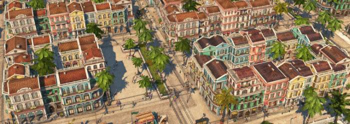

# New World Cities

Makes typical Old World construction materials production buildings available in the New World.

## Buildings

Some buildings are a bit slower than their Old World counterpart.

### Steel Beams

- Steelworks
- Furnace
- Iron Mine: buildable on gold deposits

### Windows

- Window Makers
- Glassmakers
- Sand Mine: buildable on clay deposits

### Reinforced Concrete

- Concrete Factory
- Limestone Quarry: buildable on clay deposits

## Other

- Fixes the floating celluloid.

## Translations

Available: all

[Project on GitHub](https://github.com/jakobharder/anno-1800-jakobs-mods)
