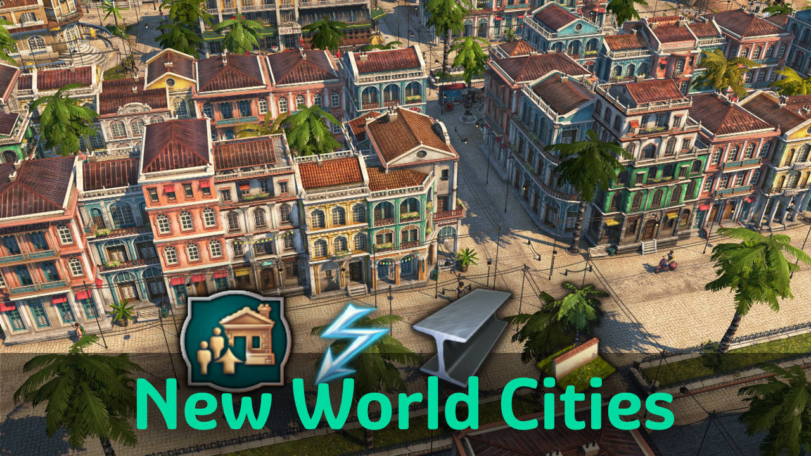
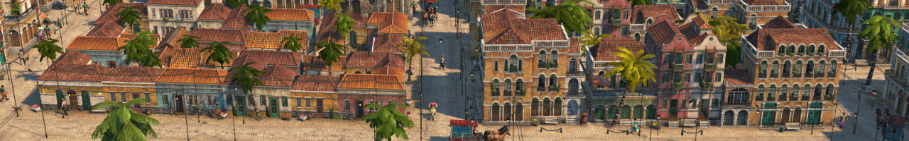
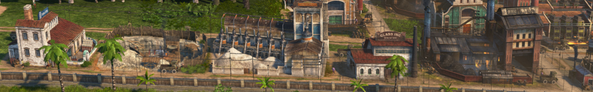
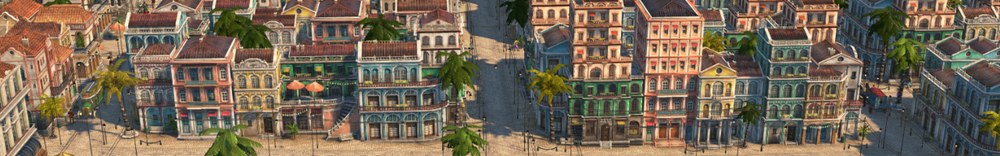

Terraced houses with more population, new needs and material productions for the New World.

## Recommended Mods

- `Streets & Railways` changes NW streets to a sandier look.
- `New World Tourism` tourists benefit from local production of bread and jam.

## Content

### 1 - Terraced Houses

*Unlocks at 750 obreros - or creative mode*

**Residences** with increased population capacity.
They merge into blocks like Engineers and Investors.

- Terraced **Jornaleros**
  - 15 additional residents with tortillas, bread and cheese as basic needs.
  - 5 additional residents with jam as lifestyle need.
- Terraced **Obreros**
  - 15 additional residents with bread, cheese and electricity as basic needs.
  - 5 additional residents with jam as lifestyle need.

**Production** of new additional needs for terraced houses.

- Maize **Bread**
  - Bakery consuming flour
  - Mill consuming wood and corn
- Minas **Cheese**
  - Dairy consuming milk
  - Milking parlour
- Citrus **Jam** (only with mod `NW Tourism`)
  - Jam kitchen consuming citrus

**Ornaments** with fitting ground for new terraced houses.

- Dirt paving: empty tile, Hacienda walls (only with DLC `Seeds of Change`)
- Stone paving: empty tile
- Diagonal enclosed greenery on plaza and stone pavement
- Skins with diagonal and other corner variations for fences and park paths

### 2 - Materials & Electricity

*Unlocks at 1500 obreros or 300 artistas - or creative mode*

**Construction materials** can be produced in the New World now.

- **Steel Beams**
  - Steelworks
  - Furnace
  - Iron mine buildable on gold deposits
- **Windows**
  - Window makers
  - Glassmakers
  - Sand mine buildable on clay deposits
- **Reinforced Concrete**
  - Concrete factory
  - Limestone quarry buildable on clay deposits

**Electricity** in combination with other mods.

- Enable electricity in the New World (without extra good output like DLC12)
- Enable power plants from
  - `Nate's Windmill`,
  - `Biogas Production` and
  - `Industrial Cities` in the New World.

### 3 - Terraced Artistas

*Unlocks at 300 artistas - or creative mode*.
Only with DLC `New World Rising`.

**Residences** with increased population capacity.

- Terraced **Artistas**
  - 30 additional residents with bread, gramophones and electricity as basic needs.
- Artista skyscrapers (only with DLC `The High Life`)
  - 50 additional residents with bread, gramophones, electricity, violins and canned fish as basic needs.

## Vanilla Bugfixes

- Fixes tropical forest variant 7 grass color

## Changes

### 2.2

- 2.2.8: Improved Russian translations thanks to DATM
- 2.2.5: Minor fixes
- 2.2.5: Added missing translations
- 2.2.1: Improved Polish translation by Bzhydack (thanks!)
- Added Harborlife support for terraced houses
- Improved Chinese translation (thanks to hanthe2nd)
- Improved Spanish translation (thanks to mfuegar)
- Improved Russian translation (thanks to DrD_AVEL)
- Added cheese diary to various buffs (e.g. food production)

### 2.1

- 2.1.1: Compatibility change to support other NW electricity mods
- Floor upgrade button to upgrade from vanilla to terraced residences
- Unlock floor upgrade button in construction menu (only with DLC `The High Life`)
- Fixed residences being unlocked too early
- Updated Korean translations (thanks to modpark817)

### 2.0

- 2.0.2: fixed missing obrero -> artista upgrade
- 2.0.2: fixed issue with needs menu of artista skyscrapers
- 2.0.2: fixed duplicate citrus jam entry in consumables
- Added terraced jornaleros and obreros
- Added NW bread production: flour mill, bakery
- Added NW cheese production: milking parlor, cheese dairy
- Added NW jam kitchen (only with mod `New World Tourism`)

## Credits

Thanks to Lordy for the milking parlor model.

Thanks to HeroOfOlympus, darknesswei, mfuegar, DrD_AVEL, modpark817, DATM for the translations!
