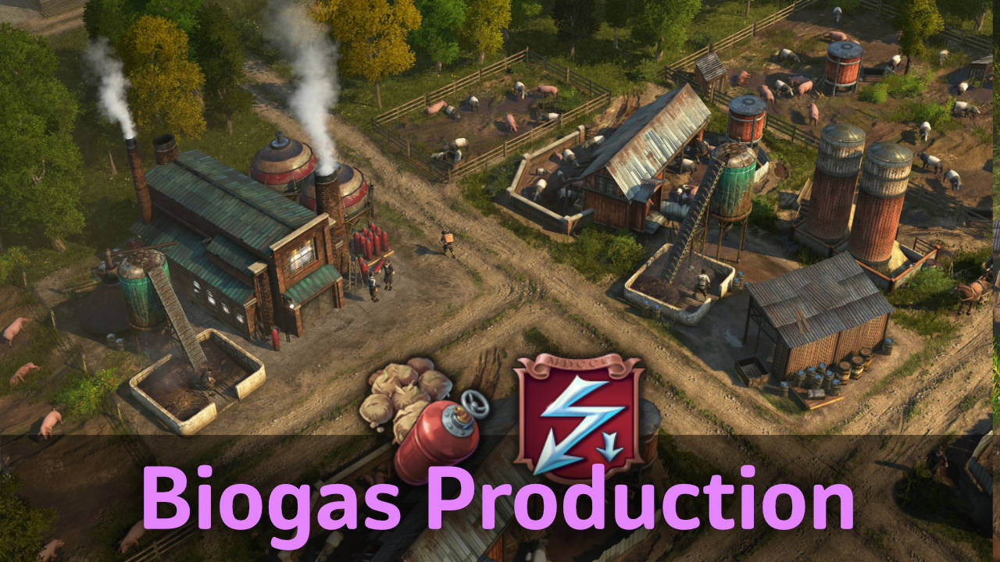

The biogas plant converts dung from animal farms into gas for use in power plants.

## Requirements

Some buildings are limited to DLCs:

- Gas Power Plant: only with activated DLC `The Passage`.
- Gas Fuel Station: only with activated DLC `Bright Harvest`.

## Buildings

You find the biogas production in the material menu, and in the gas electricity menus.

All buildings unlock with 500 engineers.

### Dung Collector

- The collector provides a buff to nearby animal farms in the OW and NW to produce extra dung.
- Dung per any farm (OW): every 120s without silo.
- Dung production NW is same as with the Fertilizer building and will not stack.

### Biogas Plant

- The plant processes dung into gas.
- Biogas: every 45s using 3 dung per cycle
- By-product: Fertiliser every 45s

## Gas Fuel Station

- Converts gas into fuel for tractors every 45s.

### Small Gas Power Plant

- A power plant consuming only half compared to the Arctic Gas-fired Power Plant in exchange for a reduced range.

## Changes

### 1.7

- Gas Fuel Station
- Biogas Plant produces Fertilizer as by-product
- Improved construction menu InfoTips
- Lowered unlock to 500 Engineers

### 1.6

- 1.6.3: Updated Korean translations (thanks to modpark817)
- 1.6.2: Russian translation
- 1.6.1: Fixed blurry icons
- Immediately unlock in creative mode

## Credits

Thanks to darknesswei, Tonton Yip, mfuegar, DrD_AVEL, modpark817 for the translations!
