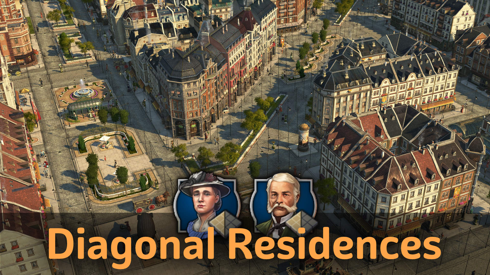

Add diagonal residences and ornaments to break up the standard grid.

## Recommended Mods

- `Electric Poles` changes poles and wires into more elegant versions that work well with diagonals.

## Buildings

Use Shift+V to cycle through variations before you place it.
You need to relocate if you want to change an existing building.

Buildings are fully functional, but expect some visual and user experience oddities as there is no true diagonal support.

### Residences

- Diagonal and narrow 3x1 engineers + 3 custom roof skins
- Diagonal and narrow 3x1 investors + 4 custom roof skins
- Vibrant Cities skins are supported
- Additionally, skins matching jje1000's red tile roof buildings for engineers

### Ornaments

- Diagonal enclosed greenery on plaza and stone pavement
- Skins with diagonal and other corner variations for fences and park paths

## Notes

You might be interested in the following mods from other creators:

- [`Diagonal Roads`](https://www.nexusmods.com/anno1800/mods/164) - diagonal pavement and fence ornaments
- [`Diagonal Hedges as Skins`](https://www.nexusmods.com/anno1800/mods/589) - makes above fence ornaments available as skins
- [`Plaza Streets [Spice it Up]`](https://mod.io/g/anno-1800/m/plaza-streets) - adds plaza tiles with street function

Known issues:

- People can go into a corners of the buildings in some situations.
  There is an ornament included to place on diagonal endings to prevent such glitches.
- Horses, bicycle riders will be a bit drunk on diagonal roads ;-)

## Changes

### 1.10

- Allow direct construction of investors only with `Instant Residences` mod
- Updated description

### 1.9

- 1.9.1: Move unlock after first engineer/investor has been built
- 1.9.1: Updated Korean translations (thanks to modpark817)
- Added narrow 3x1 tiles investor residence
- Added `Vibrant City` skins to narrow engineer residence
- Reduce lifestyle needs of narrow residences to 1/3 population

### 1.8

- 1.8.1: fixed giant showing up in single greenery ornaments
- Added NW variants of all ornaments
- Fixed plaza greenery corner hitbox

### 1.7

- 1.7.1: Fixed missing plaza ground when on light shift+g grass
- 1.7.1: Added to ornaments tab
- Added greenery wall with diagonal skin
- Added corner variations skins to fences, park paths

## Credits

Thanks go to Aveneger432, HeroOfOlympus, darknesswei, Tonton Yip, mfuegar, DrD_AVEL, modpark817 for the translations!
