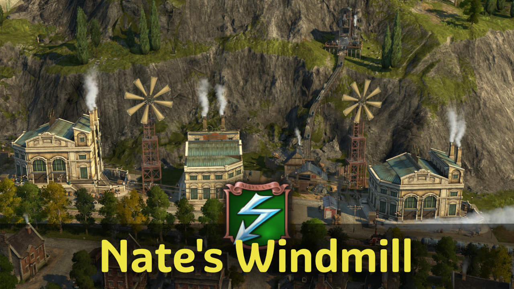

The windmill is a service building providing electricity to industry and residents.
It's intended as an alternative to Nate's electricity items for guild houses - a little cheaper, but not as powerful to keep it balanced.

## Buildings

### Nate's Windmill

Electricity is provided the same way power plants work via roads.

The building has a small guild house radius, meaning you cannot build another guild house or windmill overlapping with its area.

The reduced ranges and exclusive radius are there to ensure the windmill is not just cheaper and more powerful than other power plants or the original item + guild house combination.

Industry influence buff apply.
Palace buffs and obviously guild house buffs don't.

## Other

### Grain Mill Bugfix

Includes a fix to correct the fan direction of grain mills.

## Changes

### 1.6

- 1.6.3: Updated Korean translations (thanks to modpark817)
- 1.6.2: Russian translation
- 1.6.1: Fixed blurry icons
- Immediately unlock in creative mode

## Credits

Thanks to mfuegar, DrD_AVEL for the translations!
