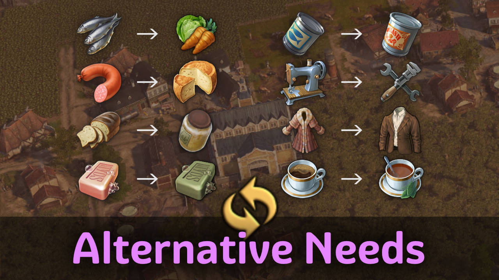

# Alternative Needs

Makes products from `[Shared] Extra Goods (Jakob)` available as alternative Lifestyle needs to Basic needs.

## Requirements

You need `[Addon] Pescatarians (Jakob)` and `[Addon] Industrial Cities (Jakob)` to play.

## Alternative Needs

Every end product of the production chains can be used as an alternative input for Basic Needs.
Enable it in the Lifestyle needs and when fulfilled it will fulfill it's counterpart.

If both needs are provided, the alternative is consumed first.
There is no double consumption.

## Changes

### 1.3

- Added compatibility with the mod `Clarks Tailoring`
- Yet another fix for multiplayer

### 1.2

- 1.2.6: Made tea icon more distinguishable
- 1.2.5: Russian translation
- 1.2.4: Load mod last to avoid conflicts with mods overwriting full menu entries
- 1.2.3: Fixed blurry icons
- 1.2.2: Internal changes
- 1.2.1: Another fix for alternative needs buff in other sessions
- Works in all sessions
- Should work in multiplayer. Please report if you have troubles.

### 1.1

- Moved combined construction menus from extra goods to this mod

### 1.0

- Moved out of `[Shared] Extra Goods (Jakob)`

## Translations

Available: Chinese, French, English, German, Polish, Russian, Spanish

Thanks to redzmey1, darknesswei, HeroOfOlympus, Tonton Yip, mfuegar, DrD_AVEL for the translations!
