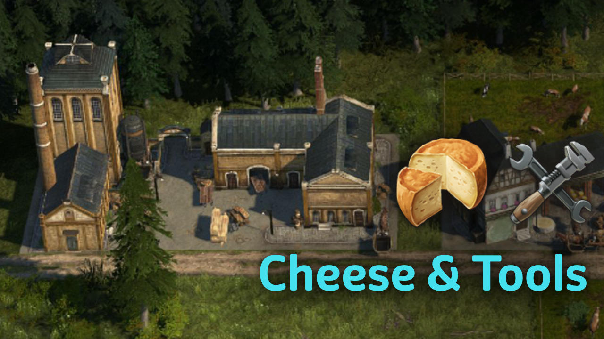

This is a small mod to add only Cheese and Tools as a lifestyle needs to provide some population boost.

Cheese is unlocked at 1 worker, Tools are at 900 artisans.

Note: this is an excerpt out of my other mods, so it will be automatically disabled if you play with `Industrial Cities`.
