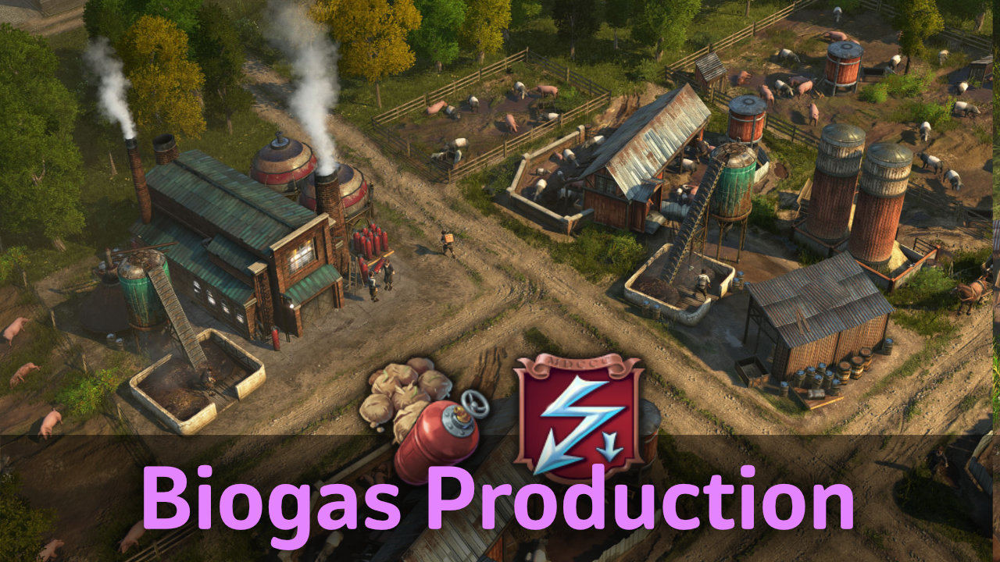

# Biogas Production

The biogas plant converts dung from animal farms into gas for use in power plants.

## Requirements

- Activated DLC `The Passage`.
- DLC `Seeds of Change` is not required.

## Buildings

You find the biogas production in the material menu, and in the gas electricity menus.

### Dung Collector

- The collector provides a buff to nearby animal farms in the OW and NW to produce extra dung.
- Dung per any farm (OW): 0,5/min or 1/min with silo
- Dung production NW is same as with the Fertilizer building and will not stack.

### Biogas Plant

- The plant processes dung into gas.
- Biogas: 1,33/min using 3 dung per cycle

### Small Gas Power Plant

- Power plant consuming only half compared to the Arctic Gas-fired Power Plant in exchange for a reduced range.

## Changes

### 1.6

- 1.6.2: Russian translation
- 1.6.1: Fixed blurry icons
- Immediately unlock in creative mode

### 1.5

- Added Small Gas Power Plant (from Small Power Plants)

## Translations

Available: Chinese, French, English, German, Korean, Polish, Spanish

Thanks to darknesswei, Tonton Yip for, mfuegar, DrD_AVEL translations!

[Project on GitHub](https://github.com/jakobharder/anno-1800-jakobs-mods)
