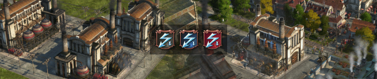

# Small Power Plants

Small power plant have less coverage than normal plants and consume coal, oil or gas.

## Requirements

The small gas power plant should be playable without `The Passage` DLC. You need the mod `Small Power Plants, Biogas` then to get gas though.

Fuel station is only available if you have `Bright Harvest` active.

## Buildings

### Electricity

- Coal Power Plant with bonus when built next too coal mines
- Small Oil Power Plant
- Small Gas Power Plant

Use the mod `[Addon] New World Cities` to enable the power plants in the New World.

### Fuel

- Fuel Station with integrated oil pump

## Changes

### 2.7

- Fuel station with integrated oil pump

### Older

- 2.6: Chinese translation
- 2.5: NW Oil and Gas Power Plants (when enabled via separate mod)
- 2.4: Fixed GU14 maintenance buff
- 2.3: Fixed coal power plant pollution category
- 2.2: Coal mines have increased range when built next to coal mines.
- 2.0: Added coal and oil power plants

## Translations

Available: English, German, Korean, Polish, Chinese

Thanks to
- MSHS for Korean translation
- Aveneger432 for Polish translation
- darknesswei for Chinese tranlsation

[Project on GitHub](https://github.com/jakobharder/anno-1800-jakobs-mods)
