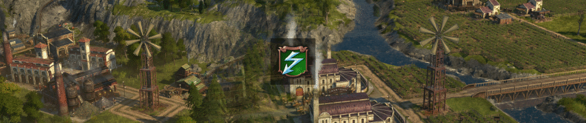

# Nate's Windmill

The windmill is a service building providing electricity to industry and residents.
It's intended as an alternative to Nate's electricity items for guild houses - a little cheaper, but not as powerful to keep it balanced.

## Requirements

You need to use Mod `[Gameplay] Small Power Plants, New World` to use the windmill in the New World.

## Buildings

### Nate's Windmill

Electricity is provided the same way power plants work via roads.

The building has a small guild house radius, meaning you cannot build another guild house or windmill overlapping with its area.

The reduced ranges and exclusive radius are there to ensure the windmill is not just cheaper and more powerful than other power plants or the original item + guild house combination.

Industry influence buff apply.
Palace buffs and obviously guild house buffs don't.

OW windmill unlocks with 500 engineers and NW windmill with 1500 obreros.

## Other

### Grain Mill Bugfix

Includes a fix to correct the fan direction of grain mills.

## Changes

### 1.4

- Include grain mill fix.

### 1.3

- NW Windmill (when enabled via separate mod)
- Removed Windmill from Palace range increase buff

### 1.2

- Reduced building and maintenance cost
- Can be played without Cap Trelawney session now
- Performance optimization (reduced GPU memory usage as Nate's original texture is 60MB huge)

## Translations

Available: English, French, German, Italian, Polish, Russian, Spanish, Japanese, Korean, Simplified Chinese, Traditional Chinese

Contact me if you have new or improved translations.
