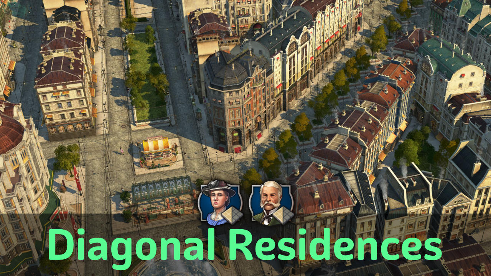

# Diagonal Residences

## Buildings

Use Shift+V to cycle through variations before you place it.
You need to relocate if you want to change an existing building.

### Residences

- Diagonal Engineers: including Vibrant Cities and 4 custom skins
- Diagonal Investors: including Vibrant Cities and 3 custom skins
- Narrow Engineers
- Skins matching jje's Red Tile Roof buildings for Engineers

### Ornaments

- Diagonal Enclosed Greenery on plaza and stone pavement
- Skins with diagonal and other corner variations for fences and park paths

## Notes

You might be interested in the following mods as well:
- [Diagonal Roads](https://www.nexusmods.com/anno1800/mods/164) - diagonal pavement and fence ornaments
- [Diagonal Hedges as Skins](https://www.nexusmods.com/anno1800/mods/589) - makes above fence ornaments available as skins
- `[Ornamental] Plaza street` from [Spice it Up](https://www.nexusmods.com/anno1800/mods/5) - plaza tiles with street connection

Known issues:

- People can go into a corners of the buildings in some situations.
  There is an ornament included to place on diagonal endings to prevent such glitches.
- Horses, bicycle riders will be a bit drunk on diagonal roads ;-)

## Changes

### 1.7

- Added greenery wall with diagonal skin
- Added corner variations skins to fences, park paths

### 1.6

- 1.6.3: Russian translation
- 1.6.2: Updated Spanish translations
- 1.6.1: Fixed blurry icons
- Fixed icons for GU17
- Immediate unlock in creative mode
- Skin for jje's red tile roof is now included and automatically shows when needed

### 1.5

- 1.5.3: Fixed investor unlock
- 1.5.2: Add missing Lifestyle needs for Investors
- 1.5.1: Fixed upgrade choosing wrong shape
- Added Investors

### Older

- 1.4: Fixed narrow building unlock
- 1.3: internal clean-up
- 1.2: Fixed narrow building consumption and costs
- 1.2: Improved buff target names (i.e. "Affects x Residences")

## Translations

Available: Chinese, French, English, German, Polish, Spanish

Thanks go to Aveneger432, HeroOfOlympus, darknesswei, Tonton Yip, mfuegar, DrD_AVEL for the translations!
