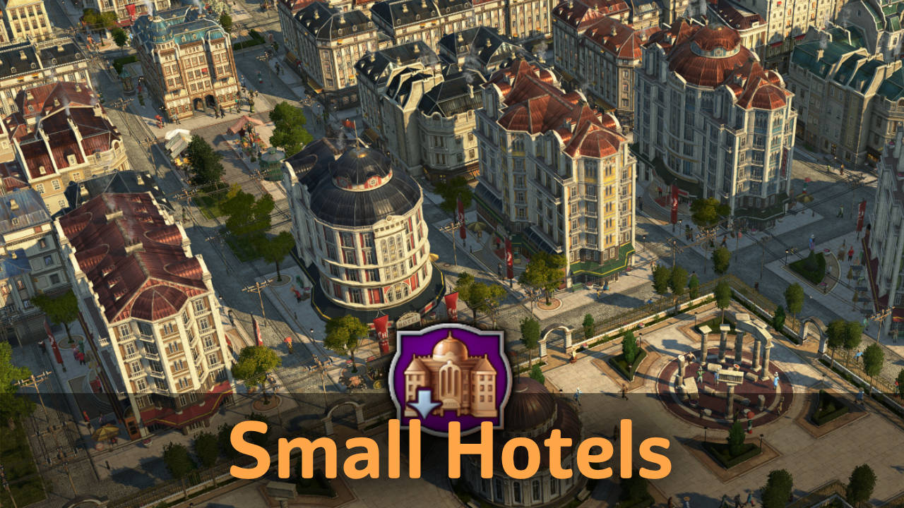

# Small Hotels

Includes a small hotel with 4 variations and many paintbrush skins for both small and normal hotel.

## New World Tourism

The small hotels and normal hotel skins can be used in the New World if you use the [New World Tourism](https://github.com/anno-mods/New-World-Tourism) mod.

The unlocks for the Christo Redentor monument are changed as well.
Now 1500 Tourists are needed for construction and 2500 to unlock the basic need.

Note: you may still see the old unlocks, but the new unlocks should be still in effect.

## Notes

- Compatible with New World Tourism
- Compatible with Trains Stations & Hotels when 'Train-Stations, Make compatible with NW Tourism' is used.

## Changes

### 1.5

- 1.5.1: Fixed blurry icons
- Immediate unlock in creative mode
- Fix missing hotel skins

### 1.4

- 1.4.1: Fixed compatibility issues with `Train-Stations and Hotels`.
- Fixed missing skin

### 1.3

- Fixed no matching node warning
- Chinese translation

### 1.2

- Added reduced floor skins to small and vanilla hotels
- Added NW hotels

## Translations

Available: Chinese, French, English, German, Japanese, Polish, Spanish

Thanks to Aveneger432, darknesswei, Tonton Yip, mfuegar for tranlsations

[Project on GitHub](https://github.com/jakobharder/anno-1800-jakobs-mods)
