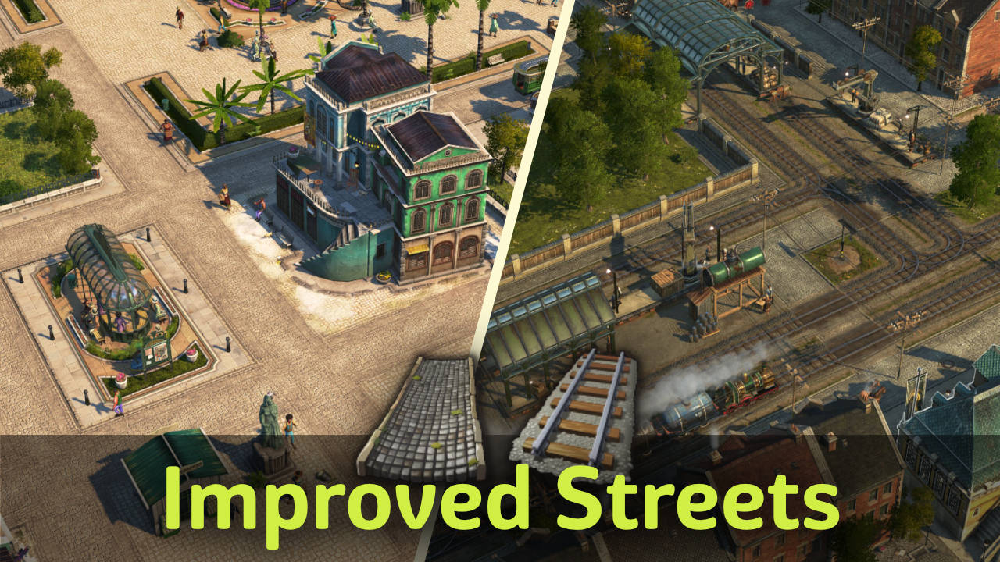

Exchange power lines, railways and New World stone streets with visually improved versions.

The railway texture is inspired by [Gravel Railway Retexture](https://www.nexusmods.com/anno1800/mods/391) by Bluesatin.

## Savegame Impact

When **activating**: bridges won't automatically change to the new texture.
You need to rebuild them.

When **deactivating**: bridges with the new texture will disappear.
You need to rebuild them.

## Compatibility

The following changes happen when other mods are active:
- `Stone Railway`: railway textures of that mod are used instead
- `Electric Lightling instead of Electricity Wires`: light posts of that mod are used instead
- `MuggenTours_MU`: off-street poles of that mod are used instead

## Disable Features

You can use the following mods to disable features:
- `Disable Railway` to use the vanilla railway texture
- `Disable Streets` to use the vanilla street texture

## Changes

### 2.0

- merged with `Eletric Poles` mod
- support for railway and street disable mods
