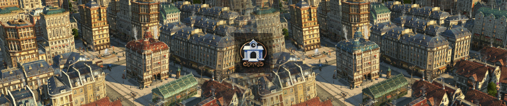

# New Town Hall, as Variations

[Project on GitHub](https://github.com/jakobharder/anno-1800-jakobs-mods)

## Notes

- You need the High Life DLC.

- This mod ("as Variations") enables shift+v variations of the new town hall.

  Tower versions are not part of the variation version.
  Also, the AI may build the new variations as well.
  Please use the building version if that's not what you want.

  The variation and building versions are completely separate and can be activated/deactivated to your liking.
  
  ⚠ Please always update both, if you use both. They share models and textures to reduce GPU memory usage.

- ⚠ The mod may shift other shift+v variations in your existing save game.
  I.e. the mod comes alphabetically before "[The Colour Collection] Buildings" and will shift those town hall variations.
  If you want to avoid this rename this mod into "[zMisc] Town Hall Variations" to make sure it comes last. 

- Works with existing save games.

## How it works

Press shift+v with a selected town hall to change its visuals.
Nothing else is changed.

## 1.2 Changes

- new ground texture fitting better to both plaza and roads
