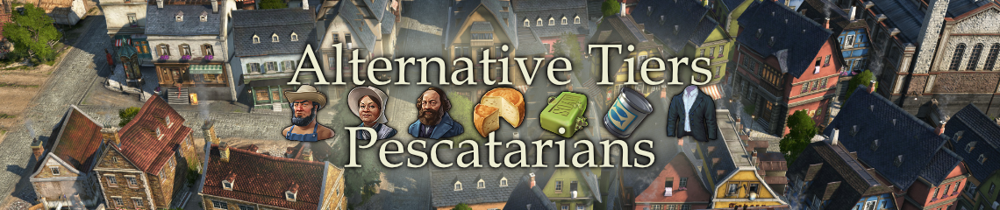

# Pescatarians

[Project on GitHub](https://github.com/jakobharder/anno-1800-jakobs-mods)

Alternative Old World population providing extra farmer workforce.
Only partially playable without DLCs.

Pescatarians have new needs. There are two ways to get them:

1. Lands of Lions DLC + "[Shared] Extra Goods Collection" mod for production chains.
2. Or instead: Docklands DLC
- Optional: Residences only change their visuals when played with "[Misc] Colored Roofs, Residences". 

## Population

Farmers (10) need community center and potatoes instead of marketplace and working cloth.

Workers (16 + 6 extra farmers) need cheese and olive soap instead of sausages and normal soap.

Artisans (24 + 4 extra workers, 10 farmers) need canned fish and suits instead of canned food and fur coats.

Engineers (40) are normal engineers, except they accept both canned fish/canned food and suits/fur coats. They can be upgraded to normal skyscapers or investors.

Suits and canned fish factories reduce consumption when close to residences.

## Changes

### Unreleased

- Fixed warehouse/docklands goods issues
- Increased trade price of cheese (45 -> 80)
- Added music school as public service / luxury need for Pescatarian Workers and Artisans.

### 1.2

- Removed doubled canned fish, suits in consumable construction menu

### 1.1

- Trade contracts for new basic needs

## Notes

Known issues

Original engineers may complain about missing canned fish need, even though they do not need it.

## Translations

Available: English, German, Russian

Thanks to redzmey1@nexus for Russian translation!

I appreciate any translation feedback! https://discord.com/invite/KtfWbev
