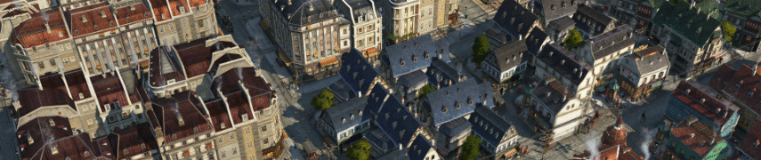

# Colored Roofs, Residences

Various roof colors as paintbrush skin for Artisans and Engineers. Other tiers will follow at some time.

The roofs are colored in realtime. That leads to better performance due to less used texture memory.

You can safely add or remove the mod in existing games.

Needs at least GU 13, no DLC dependencies.

## Changes

### 1.2

- Chinese translation

## Translations

Available: English, German

Thanks to
- Aveneger432 for Polish translation
- darknesswei for Chinese tranlsation
