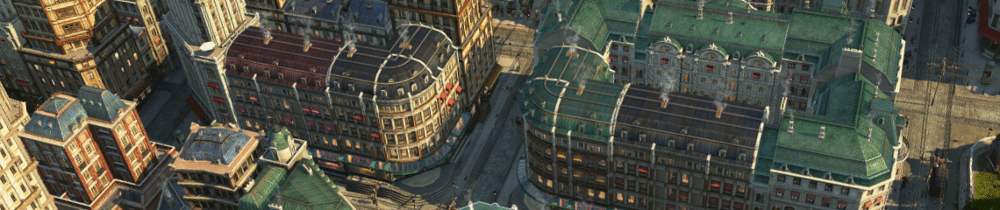

# Commercial Street

Malls and restaurants fitting into the 3x3 residential areas.

## Requirements

- DLC `The High Life` (optional: to get malls)
- DLC `Tourist Season` (optional: to get restaurants)

## Buildings

Buildings function and unlock the same as their normal counterparts, but with decreased range.

Note: The buildings do not count as quest objectives.

### Malls

- Department, Furniture and Drug Store
- Store Warehouse (+ skins for all mall types)
- Ornamental mall (+ skins for all mall types)

### Restaurants

- Courtyard Restaurant
- Cafe and Bar are TBD

## Changes

### 1.5

- Fixed restaurant townhall buffs
- Visual improvements

### 1.4

- Polish translation
- Chinese translation

### 1.3

- Added end, crossing, T-crossing variants
- Added skins to warehouse store
- Added ornamental store with

### 1.2

- Fixed GU14 maintenance buff

### 1.1

- Increased warehouse range

## Translations

Available: English, German, Korean, Polish, Chinese

Thanks to
- MSHS for Korean translation
- Aveneger432 for Polish translation
- darknesswei for Chinese tranlsation

[Project on GitHub](https://github.com/jakobharder/anno-1800-jakobs-mods)
