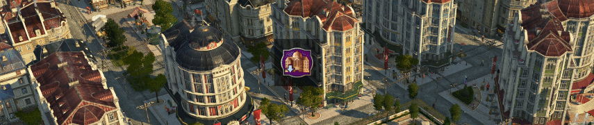

# Small Hotels

[Project on GitHub](https://github.com/jakobharder/anno-1800-jakobs-mods)

Includes a small hotel with 4 variations and many paintbrush skins for both small and normal hotel.

## New World Tourism

The small hotels and normal hotel skins can be used in the New World if you use the [New World Tourism](https://github.com/anno-mods/New-World-Tourism) mod.

The unlocks for the Christo Redentor monument are changed as well.
Now 1500 Tourists are needed for construction and 2500 to unlock the basic need.

Note: you may still see the old unlocks, but the new unlocks should be still in effect.

## Notes

- Compatible with New World Tourism
- Compatible with Trains Stations & Hotels when 'Train-Stations, Make compatible with NW Tourism' is used.

## Translations

Available: English, German, Japanese, the rest partially with English placeholders

I appreciate any translation feedback! Via Anno Modding Discord (Jakob) or Nexus (superjuern).
