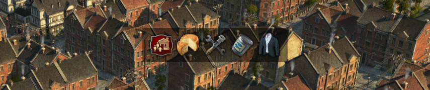

# Upgradable Workers

[Project on GitHub](https://github.com/jakobharder/anno-1800-jakobs-mods)

Skyscraper-like upgrades for worker residences. Playable without DLCs, but best with Lands of Lions.

## Workers

Level 1:
- 30 workers
- you need "[Shared] Extra Goods Collection" or DLC Docklands to fill the building.

Level 2:
- 40 workers
- you need DLC Lands of Lion or DLC Docklands to fill the building.

You can either use the skyscraper upgrade button (recommended), or the build menu as a fallback in case of mod conflicts.

Btw, City Lights Pack ornaments get a second variation with a fitting ground texture.

## Farmers & Artisans

You need more dense farmer buildings? Have a look at "[Addon] Pescatarians". Their Artisans provide +10 farmer workforce per house.

I may do upgradable Artisans in the future.

## Notes

Known issues:

- The game always prefers one direction when building a single row of houses. You have to rotate such a building everytime you place or upgrade it or its neighbors.
- Skyscraper bulk upgrade only unlocks with the High Life DLC. But the single upgrade button is always available.
- The arrows for skyscraper update doesn't show sometimes. But the building will still upgrade if you click anyway.
- The game wrongfully shows missing cheese for normal worker residences when all needs are fulfilled but people have not moved in yet. It's just an icon, nothing is missing.

## 1.1 Changes

- Trade contracts for new goods
- Some City Lights Pack ornaments have now a stone pavement ground 

## Translations

Available: all (some of the production from Extra Goods Collection is not translated though)

I appreciate any translation feedback! https://discord.com/invite/KtfWbev
